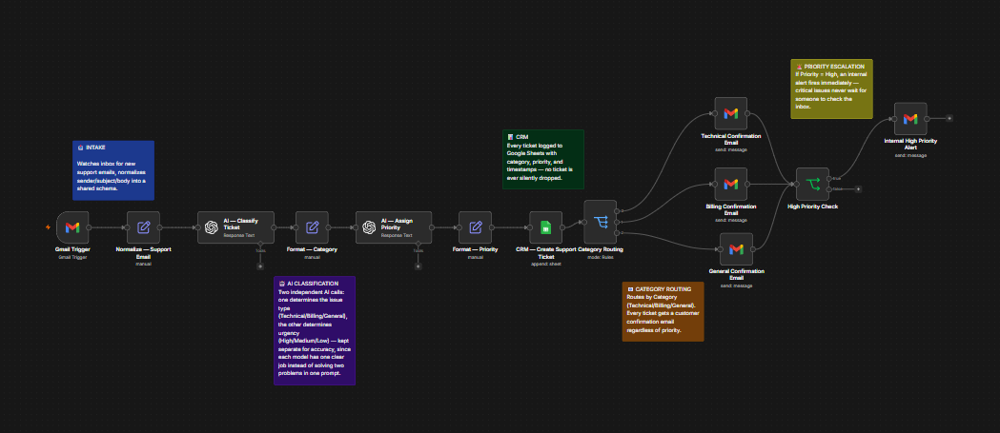
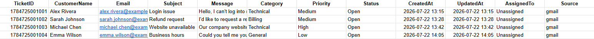
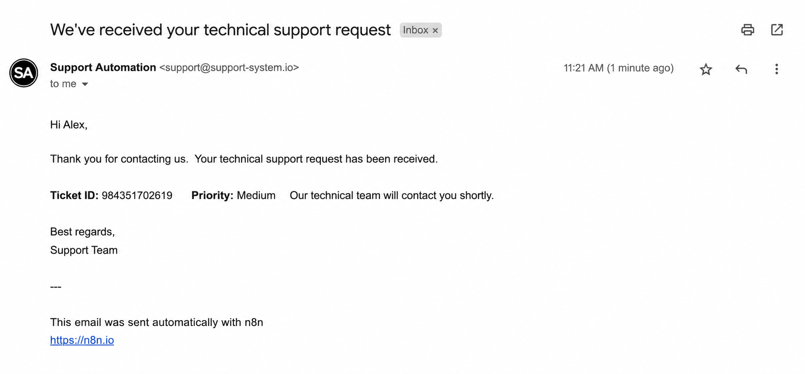
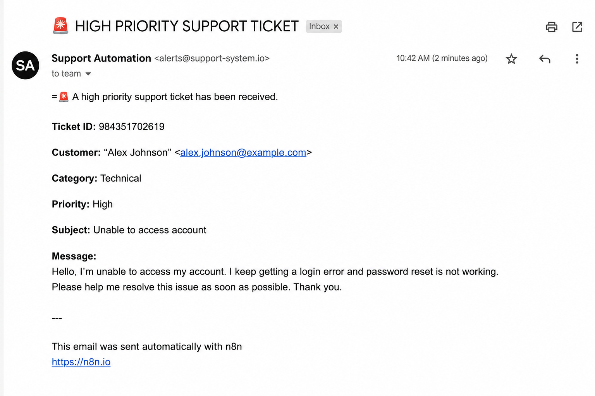

# AI Customer Support & Ticket Triage System

An AI-powered customer support automation workflow built with **n8n**, **OpenAI**, **Gmail**, and **Google Sheets**.

The system automatically classifies incoming support emails, assigns a priority, logs tickets into Google Sheets, sends customer confirmation emails, and notifies the support team about high-priority issues.

> **Business Outcome**
>
> Support requests are automatically triaged, prioritized, acknowledged, and logged within seconds. High-priority issues immediately trigger an internal alert, helping support teams respond faster while reducing repetitive manual work.

---

# Business Problem

Customer support teams often receive dozens or even hundreds of emails every day. Manually reading each message, determining its category, assigning a priority level, creating a support ticket, and replying to customers is repetitive, time-consuming, and prone to inconsistencies.

As the volume of requests grows, important issues can be overlooked while support agents spend valuable time performing manual administrative work instead of solving customer problems.

This project demonstrates how AI can automate the first stage of the support process while keeping human agents in control of the actual resolution.

---

# Solution

This workflow automatically processes every incoming support email.

Using OpenAI, it classifies the type of request and determines its priority based on business impact. The workflow then creates a structured support ticket in Google Sheets, sends a confirmation email to the customer, and automatically alerts the internal support team whenever a high-priority issue is detected.

The result is a faster, more consistent, and scalable support process with minimal manual work.

---

# Key Features

- 🤖 AI-powered ticket classification
- 🚦 AI-powered priority assignment
- 📧 Automatic customer confirmation emails
- 📊 Google Sheets ticket management
- 🚨 Internal email alerts for high-priority tickets
- 🔄 Fully automated n8n workflow
- 📥 Gmail integration
- ⚡ OpenAI-powered decision making

---

# Workflow Architecture

```text
Gmail Trigger
        │
        ▼
Normalize Support Email
        │
        ▼
AI Category Classification
        │
        ▼
AI Priority Classification
        │
        ▼
Format Category & Priority
        │
        ▼
Google Sheets (Create Ticket)
        │
        ▼
Category Routing
        ├── Technical
        ├── Billing
        └── General
                │
                ▼
Customer Confirmation Email
                │
                ▼
Priority Check
        ├── High → Internal Alert Email
        └── Medium / Low → End
```

Every incoming support email receives a customer confirmation message regardless of its priority.

High-priority tickets additionally trigger an internal alert email, ensuring critical issues receive immediate attention without affecting the customer communication flow.

---

# Tech Stack

- n8n
- OpenAI API
- Gmail
- Google Sheets
- Docker
- JavaScript Expressions

---

# Design Decisions

## Separating Category and Priority

One of the most important architectural decisions in this project was separating **Category** from **Priority**.

Instead of treating **Urgent** as a ticket category, urgency is represented only by the Priority field.

### Categories

- Technical
- Billing
- General

### Priorities

- High
- Medium
- Low

This design allows the workflow to correctly represent situations such as:

| Category | Priority |
|----------|----------|
| Technical | High |
| Technical | Medium |
| Billing | High |
| Billing | Medium |
| General | Low |

This approach avoids conflicting classifications and more closely reflects how professional help desk systems organize support tickets.

---

## Separate AI Classification and Priority Assignment

The workflow uses two independent OpenAI classification steps.

The first AI model determines **what the issue is** (Category), while the second determines **how urgent it is** (Priority).

Separating these decisions reduces prompt complexity, improves consistency, and makes the workflow easier to maintain. Each AI model performs a single, well-defined task instead of trying to solve multiple problems in one prompt.

---

# Tested Scenarios

The workflow was validated using multiple real-world support requests.

| Test Scenario | Expected Result | Status |
|---------------|-----------------|--------|
| Website completely down | Technical • High | ✅ Pass |
| Login issue | Technical • Medium | ✅ Pass |
| Incorrect invoice | Billing • Medium | ✅ Pass |
| Payment system failure | Billing • High | ✅ Pass |
| Business hours question | General • Low | ✅ Pass |
| Feature request | General • Low | ✅ Pass |
| Refund request | Billing • Medium | ✅ Pass |
| Security incident | Technical • High | ✅ Pass |

All scenarios produced the expected AI classification and priority assignment.

---

# Screenshots

## Workflow Overview



## Google Sheets Ticket Log



## Customer Confirmation Email



## High-Priority Internal Alert



---

# Setup

1. Clone this repository.
2. Import the workflow into n8n.
3. Configure Gmail credentials.
4. Configure OpenAI credentials.
5. Connect Google Sheets.
6. Update the email addresses used for customer confirmations and internal alerts.
7. Activate the workflow.

---

# Future Improvements

- Slack notifications
- Microsoft Teams integration
- Automatic ticket assignment
- CRM integration
- AI-generated response suggestions
- Ticket status tracking
- Dashboard and analytics
- Multi-language support

---

# Contact

Created by **YOUR NAME**

GitHub: https://github.com/buildwithmatyas

LinkedIn: https://www.linkedin.com/in/buildwithmatyas/

---

## Interested in a Similar Solution?

If you're looking to automate customer support workflows or build AI-powered business automations, feel free to connect with me through GitHub or LinkedIn.
